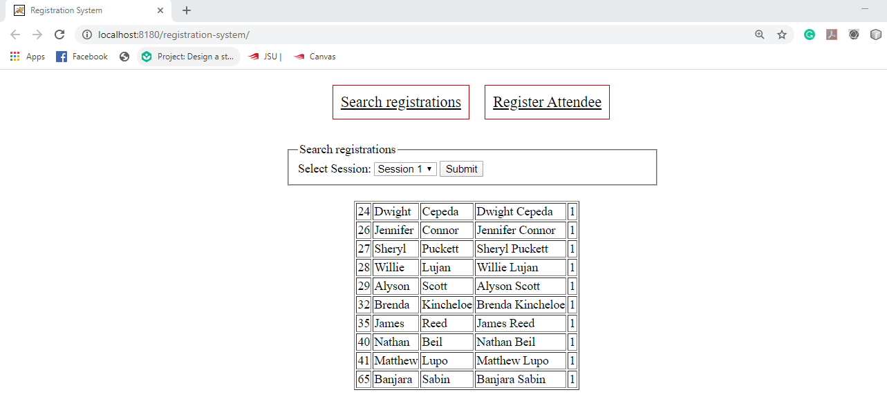
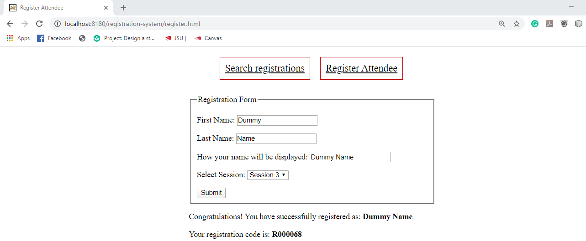

# Registration System
##
## Description
  This is a web based registration system via which a user can register and search the registrations. 
## 
  For instance, a company is conducting mandatory training classes for all of its employees; these training classes will be divided into four sessions. This application will be used at the Registration Desk to retrieve the list of attendees who have already registered for each session. There will also be a registration screen to allow last-minute attendees to register at the desk.
##
The front end is written in HTML and the server-side operations are written in Java (Java servlets) and JavaScript/jQuery (AJAX methods). When the user register, the data associated with the user namely "firstname", "lastname", "displayname", and "section number" are stored in the database using the "HTTP POST" method. When the user searches for the registrations, the data stored in the database is displayed using the "HTTP GET" method.
## 
  When the user launches this application and searches for the registrations, the webpage looks like below,
  
  
  
  And the user registration interface looks like below,
  
  

##
## Running this Project
   To run this project, you'll need Java, MySQL, Apache Tomcat Web Server, and Netbeans. Once you have all these tools ready, you can clone this project by running this command
##
            git clone https://github.com/sbanjara/registration-system
##
   After cloning this project in your workstation, you can create a web application project in Netbeans using existing project files (i.e. the cloned files).

##
## Configuring the Database for the Database Pooling
   To run this application, you'll need to import the application database (**registration_db.sql**). After importing the database, you'll need to create database account for it, and grant this account the appropriate permissions in MySQL. To do this, please run the following command from an SQL client while logged in to MySQL as root:
 ##
         source C:\USER\Desktop\registration_db.sql ( It assumes the location of sql file is in Desktop. It may be different for you.)
         
         create user 'db_user'@'localhost' identified by 'password';
         grant all on registration_db.* to 'db_user'@'localhost';
         flush privileges;
 ##
   The **"db_user"** is for the database pool.
 
 ##
 ## Structure

