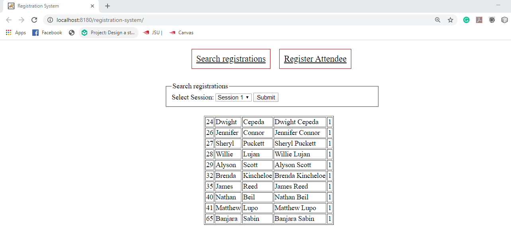

# Registration System
## Description
  This is a web based front desk registration system via which an user can either register for an event or search all the attendees
  for an event. The front end is written in plain HTML and the server-side operations are written in Java (Java servlets) and JavaScript/jQuery (AJAX methods). When the attendees register, the data namely "firstname", "lastname", "displayname", and "section number" are stored in the database using the "HTTP POST" method. When the user searches for the registrations, the data stored in the database is displayed using the "HTTP GET" method.
  
  When the user launches this application and searches for the registrations, the page looks like below,
  
  
  And when the user registers, the page looks like below,
  
  
  
## Running this Project
   To run this project, you'll need Java, MySQL, Apache Tomcat Web Server, and Netbeans. Once you have all these tools ready, you can clone this project running this command
            **git clone https://github.com/sbanjara/registration-system**)
   After you clone this project, you can create a web application project in Netbeans using existing project files (i.e. the cloned files).
